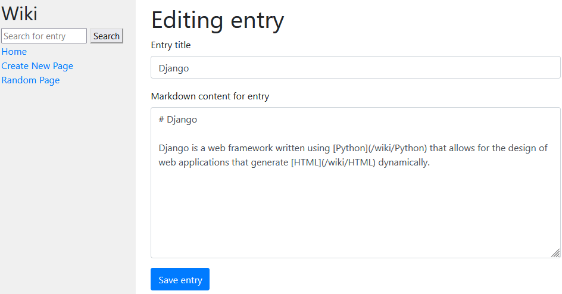

# cs50-wiki

This is Django practice project - wikipedia-like online encyclopedia. Task was taken from [CS50](https://cs50.harvard.edu/web/2020/projects/1/wiki/).

## Implemented features

- entry page listing all entries
- search for entry
- creating new entry
- editing existing entry
- page with random entry

|         |
|:---------------------------------:|
| _Page for editing existing entry_ |
